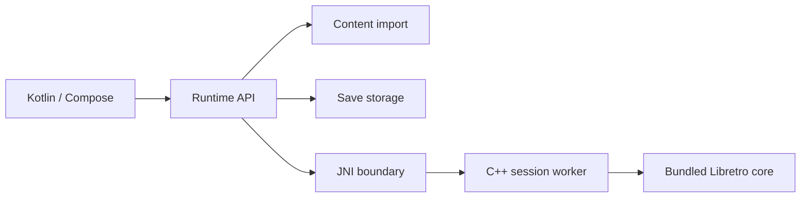

# Replay Android

An Android emulator frontend exploring modular runtime design, adaptive controls, and recoverable local persistence. Built with Kotlin, Jetpack Compose, JNI, and C++.

## Engineering highlights

- Separate runtime API, content import, native execution, and save modules.
- A native Libretro host that serializes core calls on a dedicated session worker.
- Storage Access Framework import, portable backups, checkpoint generations, and save-failure recovery.
- Adaptive layouts, orientation-specific touch controls, gamepad mappings, and diagnostics.
- CoreLab: a deterministic C++ harness with synthetic fixtures for lifecycle, video/audio, threading, and persistence contracts.
- Source-pinned build recipes for SameBoy, mGBA, and Snes9x, with upstream license notices retained.

## Architecture



## Build

Install JDK 17, Android SDK 36, NDK 28.2.13676358, and CMake 3.22.1. Set `JAVA_HOME` and `ANDROID_HOME` to your own installation locations. The Gradle wrapper uses version 9.1 and Android Gradle Plugin 9.0.1.

SameBoy's build recipe also requires Make, RGBDS tools (`rgbasm`, `rgblink`, `rgbgfx`), and `hexdump`. Core recipes fetch pinned upstream archives at build time and verify SHA-256 digests. No core download occurs at runtime.

```sh
./gradlew assembleDebug
./gradlew test lintDebug
```

## Native tests without Android

```sh
cmake -S native -B native/build
cmake --build native/build
ctest --test-dir native/build --output-on-failure
cmake -S corelab -B corelab/build
cmake --build corelab/build
ctest --test-dir corelab/build --output-on-failure
```

## Android device journeys and artifact checks

Use an isolated test emulator for the connected suite. Build both APKs first:

```sh
./gradlew :app:assembleDebug :app:assembleDebugAndroidTest
bash tools/run_device_journeys.sh emulator-5554
bash tools/verify_android_artifact.sh app/build/outputs/apk/debug/app-debug.apk arm64-v8a x86_64
```

The device suite imports an original diagnostic fixture, runs SameBoy, checks rendered frames, saves and restores state, exercises Activity recreation, simulates fold/controller transitions, and verifies failed-write recovery. Simulated transitions do not certify physical hardware. Evidence stays under ignored local `outputs/`; review it before sharing. Replace the example emulator serial with your own test emulator's serial.

See [validation](VALIDATION.md) for results from this export.

## Scope and status

This is a development portfolio project. GB/GBC, GBA, and SNES have build lanes. N64 and GameCube library recognition does not imply playable runtime support. Physical foldable/controller qualification and signed production distribution remain separate milestones. No commercial ROMs, proprietary BIOS files, user library data, or release signing keys are included.

See [licenses](licenses/README.md) for upstream terms. In particular, Snes9x has non-commercial restrictions. Original project code has no blanket license grant in this snapshot; third-party files retain their own notices.
